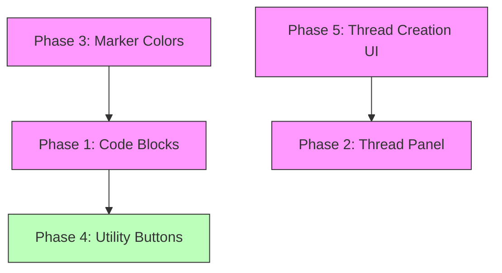

# Implementation Plans

This directory contains detailed implementation plans for the AI Chat application enhancements.

## Quick Overview

| Phase | Priority | Description | Key Files |
|-------|----------|-------------|-----------|
| [Phase 1](phase-1-code-block-handling.md) | High | Treat code blocks as single units | `MessageBubble.tsx` |
| [Phase 2](phase-2-thread-panel-redesign.md) | High | Slide-out thread panel | `ThreadPanel.tsx` (new), `App.tsx`, `ChatPanel.tsx` |
| [Phase 3](phase-3-marker-color-fixes.md) | High | Make markers more visible | `types/index.ts`, `MarkerPin.tsx`, `RightPanel.tsx` |
| [Phase 4](phase-4-utility-buttons.md) | Medium | Copy & jump buttons | `MessageBubble.tsx` |
| [Phase 5](phase-5-thread-creation-ui.md) | High | Thread creation state UI | `ChatPanel.tsx` |

## Dependencies Between Phases



**Legend:**
- Pink = High Priority
- Green = Medium Priority

### Independent Phases
- **Phase 3 (Marker Colors)** can be done independently anytime
- **Phase 4 (Utility Buttons)** can be done independently anytime

### Dependent Phases
- **Phase 2 (Thread Panel)** should ideally come after **Phase 5 (Thread Creation)** as both touch thread UI
- **Phase 1 (Code Blocks)** affects how messages render, so should be done before adding utility buttons to messages

## Suggested Implementation Order

1. **Phase 3** - Quick win, independent
2. **Phase 4** - Quick win, independent
3. **Phase 1** - Foundation for message rendering
4. **Phase 5** - Thread creation UI improvements
5. **Phase 2** - Major thread panel redesign (builds on Phase 5)

## Questions from Original todos.md

### Thread Panel Width
**Decision:** 400px (w-96) fixed width
- Provides enough space for thread content
- Doesn't overwhelm the main chat
- Consistent with RightPanel width pattern

### Code Block Detection
**Decision:** Support fenced code blocks (```) only
- Most common format in AI responses
- Easier to parse reliably
- Can add indented blocks later if needed

### Marker Colors
**Decision:** Use high-contrast Tailwind colors
| Category | Color |
|----------|-------|
| plot | Blue-500 |
| character | Emerald-500 |
| world | Amber-500 |
| note | Rose-500 |

### Button Placement
**Decision:** Hover-only on desktop, always visible on mobile
- Keeps UI clean by default
- Discoverable through hover
- Accessible on touch devices

### Thread Panel Behavior
**Decision:** Slide-out panel alongside main chat
- RightPanel stays accessible
- Main chat context preserved
- Easy to switch between threads

## File Structure

```
plans/
├── README.md                           # This file - overview and index
├── phase-1-code-block-handling.md      # Code block parsing and rendering
├── phase-2-thread-panel-redesign.md    # Thread panel slide-out redesign
├── phase-3-marker-color-fixes.md       # Marker visibility improvements
├── phase-4-utility-buttons.md          # Copy & jump utility buttons
└── phase-5-thread-creation-ui.md       # Thread creation state UI
```

## Getting Started

1. Read the phase-specific plan you want to implement
2. Review the "Files to Modify" section
3. Check for any "Questions to Resolve" - these may need user input
4. Follow the "Technical Design" section for implementation details
5. Test against the provided "Testing Scenarios" or "Testing Checklist"

## Common Patterns

### Adding New Components
- Place in appropriate `src/components/` subdirectory
- Use TypeScript interfaces for props
- Follow existing naming conventions
- Export from component file

### State Management
- Global state: Use `useAppStore` for cross-component state
- Local state: Use `useState` for component-specific state
- Follow existing patterns in the codebase

### Styling
- Use Tailwind CSS utility classes
- Follow existing color variable patterns
- Use `cn()` or similar for conditional classes
- Maintain dark mode compatibility

## Notes

- All phases maintain backward compatibility where possible
- Existing data (chats, messages, threads, markers) should remain intact
- Follow existing code style and patterns
- Test in both light and dark modes
- Test at various screen sizes
